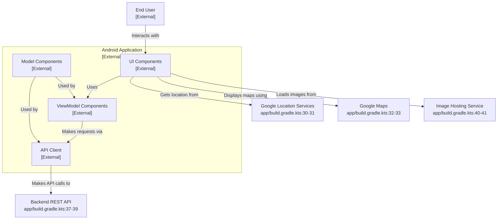

# Unnamed CodeViz Diagram

```mermaid
graph TD

    base.cv::endUser["End User<br>[External]"]
    base.cv::backendAPI["Backend REST API<br>app/build.gradle.kts:37-39"]
    base.cv::googleLocation["Google Location Services<br>app/build.gradle.kts:30-31"]
    base.cv::googleMaps["Google Maps<br>app/build.gradle.kts:32-33"]
    base.cv::imageHosting["Image Hosting Service<br>app/build.gradle.kts:40-41"]
    subgraph base.cv::androidApp_boundary["Android Application<br>[External]"]
        base.cv::uiComponents["UI Components<br>[External]"]
        base.cv::viewModelComponents["ViewModel Components<br>[External]"]
        base.cv::apiClient["API Client<br>[External]"]
        base.cv::modelComponents["Model Components<br>[External]"]
        %% Edges at this level (grouped by source)
        base.cv::uiComponents["UI Components<br>[External]"] -->|"Uses"| base.cv::viewModelComponents["ViewModel Components<br>[External]"]
        base.cv::viewModelComponents["ViewModel Components<br>[External]"] -->|"Makes requests via"| base.cv::apiClient["API Client<br>[External]"]
        base.cv::modelComponents["Model Components<br>[External]"] -->|"Used by"| base.cv::apiClient["API Client<br>[External]"]
        base.cv::modelComponents["Model Components<br>[External]"] -->|"Used by"| base.cv::viewModelComponents["ViewModel Components<br>[External]"]
    end
    %% Edges at this level (grouped by source)
    base.cv::endUser["End User<br>[External]"] -->|"Interacts with"| base.cv::uiComponents["UI Components<br>[External]"]
    base.cv::apiClient["API Client<br>[External]"] -->|"Makes API calls to"| base.cv::backendAPI["Backend REST API<br>app/build.gradle.kts:37-39"]
    base.cv::uiComponents["UI Components<br>[External]"] -->|"Gets location from"| base.cv::googleLocation["Google Location Services<br>app/build.gradle.kts:30-31"]
    base.cv::uiComponents["UI Components<br>[External]"] -->|"Displays maps using"| base.cv::googleMaps["Google Maps<br>app/build.gradle.kts:32-33"]
    base.cv::uiComponents["UI Components<br>[External]"] -->|"Loads images from"| base.cv::imageHosting["Image Hosting Service<br>app/build.gradle.kts:40-41"]

```
---
*Generated by [CodeViz.ai](https://codeviz.ai) on 11/12/2025, 11:32:57 AM*
